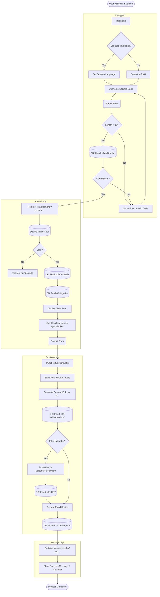

# VAU Claim v3 System Flowchart

Here is the programming flowchart for the VAU Claim System v3 (www.vau.ee/claim) based on the core architecture and flows.

```mermaid
flowchart TD
    Start([User visits claim.vau.ee]) --> Index[index.php]
    
    subgraph "index.php"
    Index --> LangCheck{Language Selected?}
    LangCheck -- Yes --> SetLang[Set Session Language]
    LangCheck -- No --> DefLang[Default to ENG]
    SetLang --> CodeInput
    DefLang --> CodeInput
    
    CodeInput[User enters Client Code] --> SubmitCode(Submit Form)
    SubmitCode --> ValLength{Length < 15?}
    ValLength -- No --> ErrCode[Show Error: Invalid Code]
    ValLength -- Yes --> DBCheckCode[(DB: Check clientNumber)]
    
    DBCheckCode --> ValidCode{Code Exists?}
    ValidCode -- No --> ErrCode
    ErrCode --> CodeInput
    end
    
    ValidCode -- Yes --> RedirectAnkeet[Redirect to ankeet.php?code=...]
    
    subgraph "ankeet.php"
    RedirectAnkeet --> RecheckCode[(DB: Re-verify Code)]
    RecheckCode --> IsCodeValid{Valid?}
    IsCodeValid -- No --> RedirectIndex[Redirect to index.php]
    IsCodeValid -- Yes --> FetchClient[(DB: Fetch Client Details)]
    
    FetchClient --> LoadCats[(DB: Fetch Categories)]
    LoadCats --> ShowForm[Display Claim Form]
    
    ShowForm --> UserInput[User fills claim details, uploads files]
    UserInput --> SubmitForm(Submit Form)
    end
    
    SubmitForm --> PostFunctions[POST to functions.php]
    
    subgraph "functions.php"
    PostFunctions --> Sanitize[Sanitize & Validate Inputs]
    Sanitize --> GenID[Generate Custom ID T... or P...]
    GenID --> InsertDB[(DB: Insert into 'reklamatsioon')]
    
    InsertDB --> CheckFiles{Files Uploaded?}
    CheckFiles -- Yes --> MoveFiles[Move files to uploads/YYYY/Mon/]
    MoveFiles --> DBFiles[(DB: Insert into 'files')]
    DBFiles --> PrepMail
    CheckFiles -- No --> PrepMail
    
    PrepMail[Prepare Email Bodies] --> QueueMail[(DB: Insert into 'mailer_user')]
    end
    
    QueueMail --> RedirectSuccess[Redirect to success.php?id=...]
    
    subgraph "success.php"
    RedirectSuccess --> ShowSuccess[Show Success Message & Claim ID]
    end
    ShowSuccess --> End([Process Complete])
```
